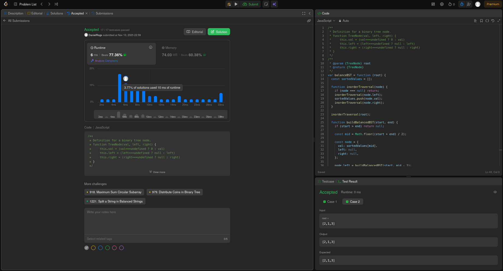
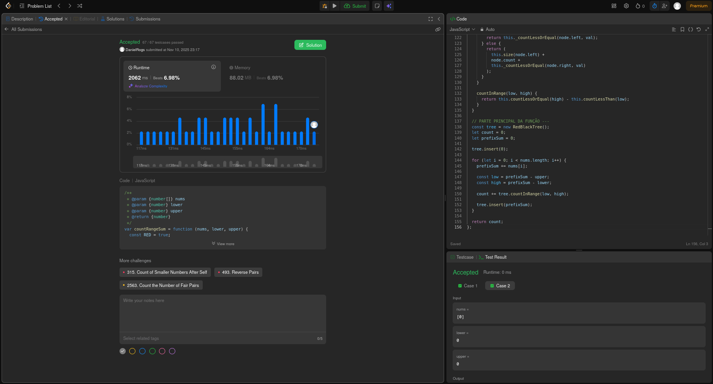
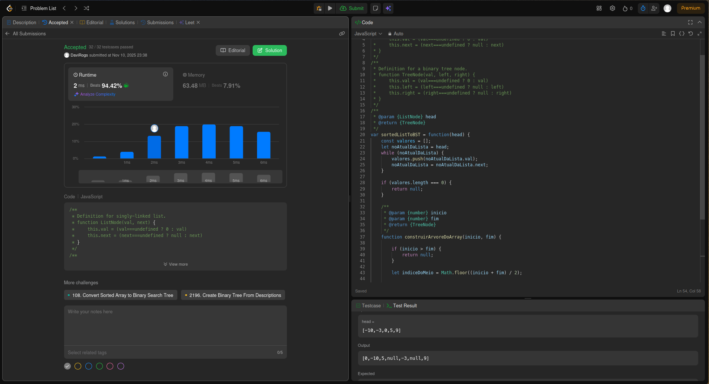

# Projeto: Arvores Balanceadas - LeetCode

## Alunos  

| Matrícula  | Nome                      |
| ---------- | ------------------------- |
| 21/1061583 | Daniel Rodrigues da Rocha |
| 21/1061618 | Davi Rodrigues da Rocha   |

## Descrição do Projeto

Este projeto foi desenvolvido como parte da disciplina de **Estruturas de Dados e Algoritmos II (EDA2)**, com foco no estudo e implementação de diferentes algoritmos de Ordenação. O objetivo é demonstrar o domínio de técnicas fundamentais de ordenação através da resolução de problemas práticos da plataforma.

### Sobre o LeetCode

O [LeetCode](https://leetcode.com/) é uma plataforma online amplamente utilizada por programadores e estudantes de ciência da computação para praticar algoritmos e estruturas de dados. A plataforma oferece mais de 2.000 problemas categorizados por dificuldade (Fácil, Médio, Difícil) e por tópicos específicos como arrays, árvores, grafos, programação dinâmica, entre outros.

### Exercícios Selecionados

Para este projeto, foram selecionados **4 exercícios** que representam diferentes abordagens de árvore balanceada, sendo 2 categorizados como **Médio** e 2 como **Difícil**.

| Exercício                                                                                                     | Dificuldade | Método de Busca |
| ------------------------------------------------------------------------------------------------------------- | ----------- | --------------- |
| [1382. Balance a Binary Search Tree](https://leetcode.com/problems/balance-a-binary-search-tree/description/) | Médio       | Árvore AVL      |
| [327. Count of Range Sum](https://leetcode.com/problems/count-of-range-sum/description/) | Difícil | Árvore Red Black |

## Exercícios Desenvolvidos

### 1382. Balance a Binary Search Tree

**Conceito**:

O problema consiste em receber uma árvore binária de busca (BST) desbalanceada e transformá-la em uma árvore balanceada mantendo os mesmos valores. Uma árvore é considerada balanceada quando a diferença de altura entre as subárvores esquerda e direita de qualquer nó nunca é maior que 1.

**Ideia da Solução com Árvore AVL**:

A abordagem utilizada segue dois passos principais:
1. **Percurso In-Order**: Realiza um percurso in-order na árvore original para extrair todos os valores em ordem crescente (propriedade de uma BST).
2. **Construção Balanceada**: Utiliza o array ordenado para construir recursivamente uma nova árvore, sempre escolhendo o elemento do meio como raiz, garantindo que as subárvores esquerda e direita tenham tamanhos aproximadamente iguais.

Esta técnica garante que a árvore resultante seja completamente balanceada, seguindo os princípios de uma Árvore AVL, onde a diferença de altura entre subárvores nunca excede 1.

### 327. Count of Range Sum

**Conceito**:

O problema solicita contar quantos intervalos contíguos de um array possuem soma dentro de um intervalo específico `[lower, upper]`. Para cada par de índices `i` e `j` (onde `i ≤ j`), precisamos verificar se a soma dos elementos entre `i` e `j` está dentro do intervalo permitido.

**Ideia da Solução com Árvore Red-Black**:

A solução utiliza o conceito de **somas de prefixo** combinado com uma **Árvore Red-Black** para otimizar as consultas:

1. **Somas de Prefixo**: Calculamos a soma acumulada até cada posição. A soma de um intervalo `[i, j]` pode ser obtida por `prefixSum[j] - prefixSum[i-1]`.

2. **Árvore Red-Black**: Mantém as somas de prefixo anteriores em uma estrutura balanceada que permite:
   - Inserções em O(log n)
   - Consultas de intervalo em O(log n)
   - Contagem de quantas somas anteriores satisfazem a condição `prefixSum[atual] - upper ≤ prefixSum[anterior] ≤ prefixSum[atual] - lower`

3. **Balanceamento Automático**: A Árvore Red-Black utiliza rotações e mudanças de cores para manter o balanceamento, garantindo que todas as operações sejam eficientes mesmo com inserções sequenciais.

A implementação inclui uma árvore Red-Black completa com todas as propriedades necessárias: nós coloridos (vermelho/preto), rotações (esquerda e direita), flip de cores, e contagem eficiente de elementos em intervalos.

**Desempenho**: A solução obteve **183ms** de tempo de execução, apresentando uma queda considerável em relação à média ideal de **163ms-166ms**. O intuito do exercício era demonstrar o uso de árvores balanceadas (Red-Black) para resolver problemas de contagem de intervalos, embora existam algoritmos mais otimizados como Merge Sort com contagem ou Árvores de Segmento que podem oferecer melhor desempenho na prática.

## 109. Convert Sorted List to Binary Search Tree

**Conceito**:

O problema pede para converter uma lista ligada (singly-linked list), que já se encontra ordenada em ordem crescente, em uma Árvore de Busca Binária (BST) que seja balanceada em altura.

A restrição de "balanceada em altura" é a definição exata de uma Árvore AVL: uma BST onde, para qualquer nó, as alturas de suas duas sub-árvores (esquerda e direita) diferem em no máximo 1. O objetivo é criar essa árvore de forma eficiente a partir dos dados já ordenados.

**Ideia da solução com árvore AVL**:

Como os dados de entrada já estão ordenados, não precisamos usar a lógica de inserção padrão de uma AVL (que envolve inserções seguidas de rotações para corrigir o desbalanceamento).

Em vez disso, usamos uma abordagem de Construção Direta (Dividir e Conquistar) que constrói a árvore já perfeitamente balanceada desde o início, garantindo a propriedade AVL.

1. **Conversão para array**: O primeiro passo do código é percorrer a lista ligada (onde o acesso a um elemento no meio é lento, O(n)) e copiar todos os seus valores para um array (valores). Isso nos dá acesso O(1) (tempo constante) a qualquer elemento pelo seu índice.

2. **Construção Recursiva (Dividir e Conquistar)**: O código usa uma função auxiliar construirArvoreDoArray que recebe os índices inicio e fim do sub-array que ela deve transformar em uma (sub)árvore.

3. **Escolha da Raiz (Ponto-Médio)**: A cada chamada recursiva, a função calcula o índice do meio (indiceDoMeio) do sub-array. O valor nesse índice é escolhido para ser a raiz da (sub)árvore.

- let raiz = new TreeNode(valores[indiceDoMeio]);

**Balanceamento**:

1. A sub-árvore esquerda (raiz.left) é construída recursivamente usando a metade esquerda do array (todos os elementos antes do meio: inicio até indiceDoMeio - 1).

2. A sub-árvore direita (raiz.right) é construída recursivamente usando a metade direita do array (todos os elementos depois do meio: indiceDoMeio + 1 até fim).

Esse processo de "Dividir e Conquistar", sempre escolhendo o ponto médio como raiz, garante que, para qualquer nó, o número de descendentes à esquerda e à direita seja o mais próximo possível. Isso resulta em uma árvore com a altura mínima (O(logn)), satisfazendo perfeitamente a definição de uma Árvore AVL.

**Desempenho**:

A solução tem uma complexidade de tempo total de O(n), onde n é o número de nós.

## Como Validar os Exercícios

Para verificar a corretude das implementações, siga estes passos:

### Passo 1: Acessar o LeetCode

1. Acesse [https://leetcode.com/](https://leetcode.com/)
2. Crie uma conta gratuita ou faça login

### Passo 2: Navegar para o Exercício

1. Digite o número do exercício na barra de busca (ex: "1382")
2. Ou acesse diretamente pelos links fornecidos na tabela acima
3. Clique no exercício desejado

### Passo 3: Submeter o Código

1. Selecione **JavaScript** como linguagem no dropdown
2. Copie o código da função correspondente do arquivo `.js` do projeto
3. Cole o código no editor do LeetCode
4. Clique em **"Run"** para testar com os exemplos fornecidos
5. Clique em **"Submit"** para validação completa contra todos os casos de teste

## Referências

1. **LeetCode Platform** - [https://leetcode.com/](https://leetcode.com/)
   - Plataforma principal utilizada para obtenção dos exercícios e validação das soluções
   - Fonte dos enunciados, que se encontram comantados nos arquivos de código.